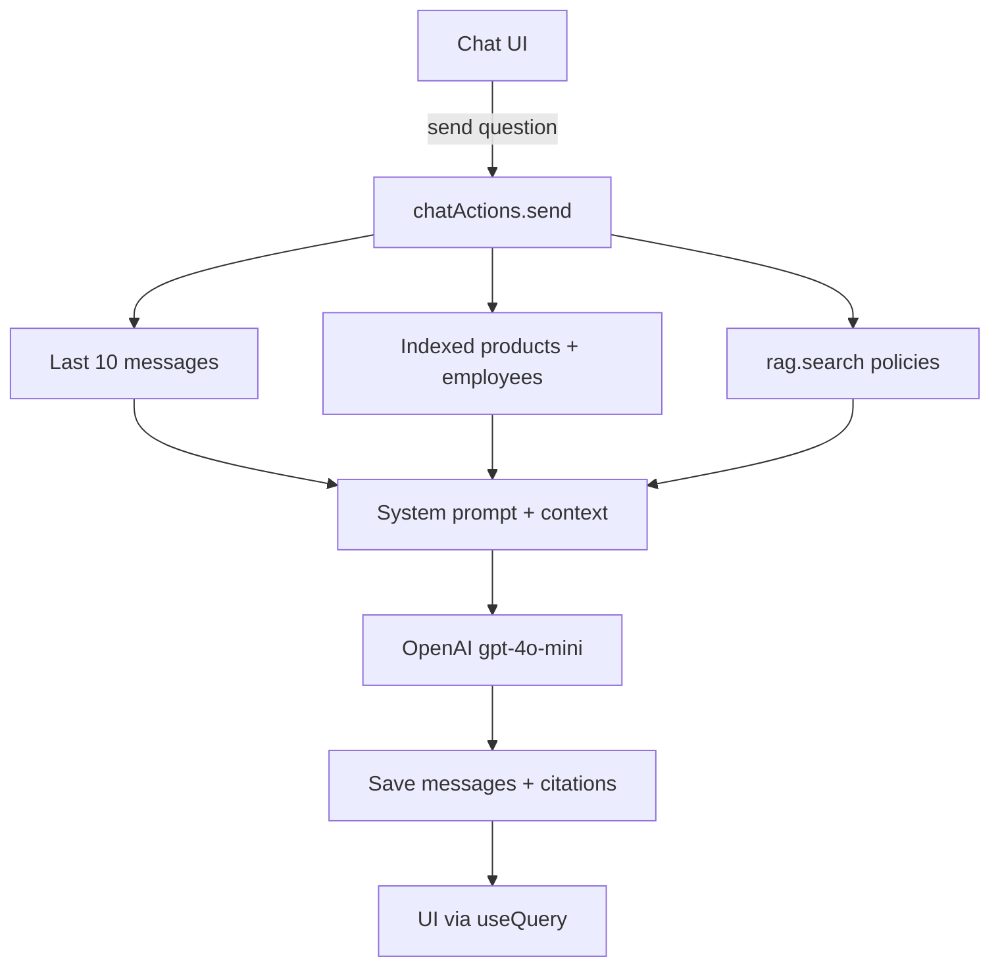

# Cerenity Assistant

Hybrid RAG chatbot for the vibe-coding take-home. It answers from a **structured catalog** (products + employees) and **unstructured handbook excerpts**, keeps a **persistent message store**, and shows citations in the UI.

Dev backend: Convex deployment `blissful-sheep-547` (project `cerenity-ai`). Production: `majestic-gazelle-859` (read-only unless you intend to ship).

## Assignment map

| Requirement | Where it lives |
| --- | --- |
| Web front-end | [`app/page.tsx`](app/page.tsx), [`components/chat/ChatWindow.tsx`](components/chat/ChatWindow.tsx) |
| AI model API | [`convex/chatActions.ts`](convex/chatActions.ts) (`generateText` + `gpt-4o-mini`) |
| Message store | `threads` + `messages` tables, [`convex/messages.ts`](convex/messages.ts) |
| Structured store | `products` + `employees` (Convex runtime) and [`db/migrations/001_init.sql`](db/migrations/001_init.sql) (portable SQL) |
| Unstructured / vectors | `@convex-dev/rag` now; [`db/migrations/002_vector_store.sql`](db/migrations/002_vector_store.sql) for a future Postgres + pgvector swap |
| CI/CD GitHub → Convex | [`.github/workflows/ci.yml`](.github/workflows/ci.yml) |

Architecture matches [A Practical Guide To Building a RAG-Powered Chatbot](https://thenewstack.io/a-practical-guide-to-building-a-rag-powered-chatbot/): retrieve chat history and knowledge in parallel, assemble a grounded prompt, call the LLM, persist both sides of the turn.



Convex is **not SQL**. Schema is applied from [`convex/schema.ts`](convex/schema.ts) by `npx convex dev` / `npx convex deploy`. The files in [`db/migrations/`](db/migrations/) are the portable contract if you later run Postgres. See [`db/README.md`](db/README.md).

## Local setup

1. Node 20+.
2. Copy [`.env.example`](.env.example) values into gitignored `.env.local` (`NEXT_PUBLIC_CONVEX_URL` is already `https://blissful-sheep-547.convex.cloud`).
3. Keep `CONVEX_DEPLOY_KEY` only in `.env.local`. A `preview:` key cannot run `convex dev`; use the logged-in Convex CLI:

```bash
npx convex dev --env-file .env.example
```

4. Set the model key **on the Convex deployment** (not in Next.js). Without this, the UI loads but every send fails:

```bash
npx convex env set OPENAI_API_KEY --env-file .env.example
```

5. Seed catalog + policy embeddings:

```bash
npx convex run seed:run --env-file .env.example
```

6. App:

```bash
npm install
npm run dev
```

Open [http://localhost:3000](http://localhost:3000).

## GitHub Actions

On pull requests: `npm ci`, lint, typecheck.

On push to `main`: `npx convex deploy --yes` using GitHub secret **`CONVEX_DEPLOY_KEY`**. That secret must be a **production** deploy key for `majestic-gazelle-859`. Do not put the local preview key in GitHub. SQL migrations are not applied in CI — Convex has nothing to run them against.

## Eval questions

See [`VIBE.md`](VIBE.md) for the eight-question set and how this was built with Cursor.
